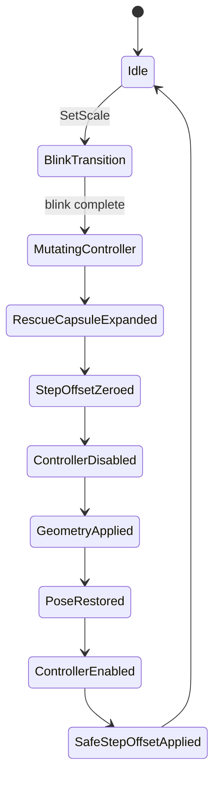

# Scale Shift CharacterController Flow

Scale changes must not expose a partially updated CharacterController to Unity.
Unity validates `stepOffset` both when the value is assigned and when the
CharacterController is enabled. The production rule is therefore:

1. Capture the camera and ground pose anchor.
2. Begin a CharacterController mutation transaction.
3. Expand the current capsule if needed so the existing serialized/runtime
   `stepOffset` is legal in both local and scaled space.
4. Force `stepOffset` to `0`.
5. Disable the CharacterController once.
6. Apply rig scale, eye height, movement values, interaction ranges, and capsule geometry.
7. Sync transforms.
8. Restore the camera XZ and ground Y anchor while the CharacterController is still disabled.
9. Sync transforms again.
10. Re-enable the CharacterController with `stepOffset` still at `0`.
11. Apply the final safe `stepOffset`, clamped by local height and scaled capsule size.

## Safety Invariants

- `stepOffset` is zero during every disable, resize, move, and enable operation.
- Existing invalid controller state is rescued by expanding height before any
  `stepOffset` write.
- Capsule radius is clamped so it cannot exceed half of capsule height.
- Final `stepOffset` is capped by:
  - local `height`
  - scaled `height + radius * 2`
  - 45% of scaled height for gameplay sanity
- The CharacterController is disabled only once per scale change.
- Pose restoration happens before re-enabling, so Unity sees the final transform.
